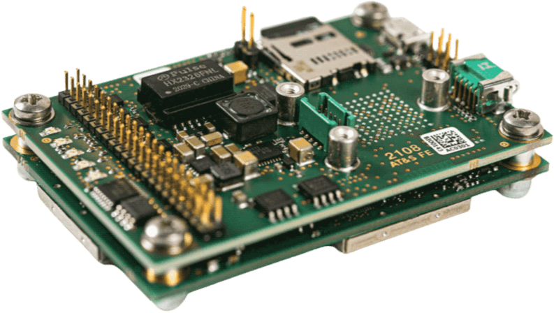

# AsteRx OEM with Robotics Interface Board

Septentrio is the leading worldwide supplier of OEM GPS / GNSS receivers. Our OEM receivers deliver accurate and
reliable positions to demanding industrial applications in a small, light-weight form factor. We also offer several dual
antenna receivers providing heading & pitch or heading & roll angles ideal for autonomous navigation or machine control.
Inertial sensor integration of the AsteRx-i family offers a full attitude solution (heading, pitch and roll)
synchronized with accurate positioning.

The Robotics Interface Board is an optional board that coupled with Septentrio GNSS receiver boards provides common
interfaces like USB, ethernet, on board logging and other functionalities designed for rapid prototyping, product
evaluation or efficient integration.

Size: 71.53 x 47.5 x 18.15 mm 

Weight = 50g

## Key features

- Credit-card size boards with low power consumption
- Easy-to-integrate into any system
- Best-in-class RTK performance with true multi-constellation, multi-frequency GNSS technology
- Advanced Interference Mitigation (AIM+) anti-jamming and anti-spoofing technology
- Resilient to vibrations and shocks
- 44 pins I/O connector for autopilots such as Pixhawk
- On-board logging
- Micro USB connector

## Purchase

All AsteRx receivers and Robotic Interface Boards can be purchased from the Septentrio webshop:

- [AsteRx-m3 Pro](https://www.septentrio.com/en/products/gnss-receivers/oem-receiver-boards/asterx-m3-pro)
- [AsteRx-m3 Pro+](https://www.septentrio.com/en/products/gnss-receivers/oem-receiver-boards/asterx-m3-pro-plus)

Other PX4 supported devices from Septentrio:
- [mosaic-go evaluation kit](../../en/gps_compass/septentrio_mosaic-go.md)

## Interfaces

### USB
_Connector type: micro USB type B._

The micro USB type B connector can be attached to a PC to power the receiver and to communicate with it over its USB
port.

### 44-pin header
_Connector type: SAMTEC TMM-122-03-S-D, 2-mm pitch._
[image]

The 44-pin header can be used to connect multiple GPIO devices. Please refer to
the [hardware manual](https://www.septentrio.com/system/files/support/asterx-m3_product_group_hardware_manual_2.2.0_1.pdf)
for the pinout.

### LED's

[image]

The LED pins can be used to monitor the receiver status. They can be used to drive external LEDs (max drive current
10mA). It is assumed that the LED lights when the electrical level of the corresponding pin is high. The general-purpose
LED (GPLED pin) is configured with the setLEDMode command.

### Log Button Header

[image]

Putting a jumper on the LOG Button header (.100” vertical header) is equivalent to pressing a “log button”. The
interface board takes care of debouncing.

### PPS/Event Header

_Connector type: SAMTEC TMM-103-03-G-D, 2-mm pitch._

[image]

The 6-pin 2mm header next to the micro USB connector exposes the first PPS signal.

### Power Supply Options

When a USB cable is connected to the micro USB connector, the interface board is powered from the computer through the
USB connector.Alternatively, the power can be applied from the PWR_IN pins of the 44-pin connector. The voltage range
when powering from the PWR_IN pins is 4.5V to 30V. Power can be applied from both sources at the same time. On-board
diodes prevent short circuits. The interface board provides the 3V3 supply to the AsteRx-m3 OEM receiver and a 5V DC
voltage to the VANT pin of the AsteRx-m3 OEM.

## Wiring Diagram

[image]

## PX4 setup

### Single antenna

Edit the following parameters in the GPS tab:

- [GPS_1_CONFIG](https://docs.px4.io/master/en/advanced_config/parameter_reference.html#GPS_1_CONFIG): TELEM1
- [GPS_1_GNSS](https://docs.px4.io/master/en/advanced_config/parameter_reference.html#GPS_1_GNSS): 31
- [GPS_1_PROTOCOL](https://docs.px4.io/master/en/advanced_config/parameter_reference.html#GPS_1_PROTOCOL): Auto detect (
  or SBF)
- [SER_TEL1_BAUD](https://docs.px4.io/master/en/advanced_config/parameter_reference.html#SER_TEL1_BAUD): 115200 8N1

Go to “Tools” > “Reboot Vehicle”

### Dual antenna

Edit the following parameters in the GPS tab:

- [GPS_1_CONFIG](https://docs.px4.io/master/en/advanced_config/parameter_reference.html#GPS_1_CONFIG): TELEM1
- [GPS_1_GNSS](https://docs.px4.io/master/en/advanced_config/parameter_reference.html#GPS_1_GNSS): 31
- [GPS_1_PROTOCOL](https://docs.px4.io/master/en/advanced_config/parameter_reference.html#GPS_1_PROTOCOL): Auto detect (
  or SBF)
- [SER_TEL1_BAUD](https://docs.px4.io/master/en/advanced_config/parameter_reference.html#SER_TEL1_BAUD): 115200 8N1
- [EKF2_AID_MASK](https://docs.px4.io/master/en/advanced_config/parameter_reference.html#EKF2_AID_MASK): Use GPS & GPS
  yaw fusion (129)
- [GPS_YAW_OFFSET](https://docs.px4.io/master/en/advanced_config/parameter_reference.html#GPS_YAW_OFFSET): set according
  to your setup

Go to “Tools” > “Reboot Vehicle”

:::note 
For optimal heading results, the two antennas should be seperated by at least 30cm / 11.8 in (ideally 50cm
/ 19.7in or more)

For additional configuration of the dual antenna setup, please refer to
our [Knowledge Base](https://customersupport.septentrio.com/s/article/Setting-up-and-configuring-the-AsteRx-i-compensating-for-a-non-default-antenna-orientation) 
:::