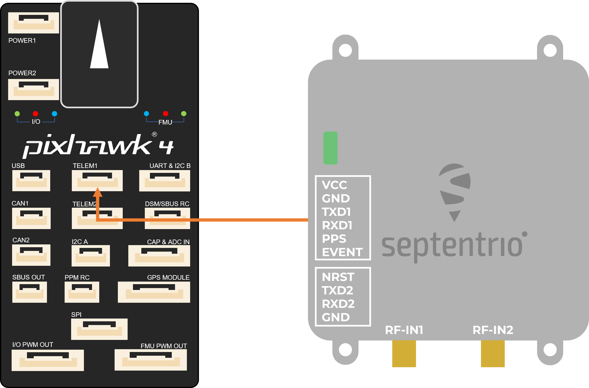

# Septentrio mosaic-go evaluation kit

The mosaic-go Evaluation Kit is composed of the mosaic module soldered on an interface board inside a metallic housing.

Sized at only 71 x 59 x 12 mm and weighing only 58 g, mosaic-go offers unmatched size to performance ratio. mosaic-go
includes:

- High update rate (>100 Hz) and low latency, both crucial for control systems of autonomous applications
- Reliable centimetre-level positioning
- Full L2 support via P(Y) code

  Mosaic-go part number:
  Single-antenna version, incorporating mosaic-X5: 410386(including accessories). Dual-antennaversion,
  incorporatingmosaic-H: 410397(including accessories).

- Size: 71 x 59 x 12 mm ± 1mm
- Weight: 58g ± 1g

## Purchase

The mosaic-go kit is available on the [Official shop](https://shop.septentrio.com/en) of Septentrio.

- [mosaic-go heading GNSS module evaluation kit](https://shop.septentrio.com/en/shop/mosaic-go-heading-gnss-module-evaluation-kit)
- [mosaic-go GNSS module receiver evaluation kit](https://shop.septentrio.com/en/shop/mosaic-go-gnss-module-receiver-evaluation-kit)

Other PX4 supported devices from Septentrio:

- [mosaic-go evaluation kit](../../en/gps_compass/septentrio_mosaic-go.md)

## The mosaic-go heading evaluation kit contains:

- 1 mosaic-H or mosaic-X5 module soldered on an interface board inside a metallic housing.
- 1 USB cable
- 6-pin COM1 open-ended cable
- 4-pin COM2 open-ended cable
- Help user guide card

## Interfaces

### USB

This micro-B connector is used to access the mosaic-go over USB. It can also be used to power the mosaic-go.

### RSV USB

This connector is reserved and should not be used.

### RF_IN1 and RF_IN2

These are the main and auxiliary antenna connectors, connected to the ANT_1 and ANT_2 pins of the internal mosaic.
Mosaic-go provides a 5V DC supply to both antenna connectors. In the dual-antenna version, a circuit similar to the one
in section 3.2.3.2is used. The combined main and auxiliary antenna power consumption must not exceed 150mA.

Note that RF_IN2 is only available on the dual-antenna mosaic-go.

### TF Card

Socket for a micro SD Card. The module can log (SBF/NMEA) files on the micro SD Card in this socket.

### 6-pin Connector

Type: GH connector, 1.25mm pitch, 6 way. Mating connector housing: GHR-06V-S

| Pin Name | Direction | Level      | Description               | Comment                                                           |
|----------|-----------|------------|---------------------------|-------------------------------------------------------------------|
| VCC      | PWR       | 4.75V-5.5V | Main power supply         |                                                                   |
| GND      |           | 0          | Ground                    |                                                                   |
| TXD1     | Out       | 3V3_LVTTL  | Serial COM1 transmit line | Directly connects to TXD1 of internal mosaic                      |
| RXD1     | In        | 3V3_LVTTL  | Serial COM1 receive line  | Directly connects to RXD1 of internal mosaic                      |
| PPS      | Out       | 3V3_LVTTL  | PPSoutput                 | PPSO from mosaic converted to 3.3V                                |
| EVENT    | In        | 3V3_LVTTL  | Event timer input         | Connects to EVENTA of mosaic through a 3V3to 1V8 level translator |

### 4-pin Connector

Type: GH connector, 1.25mm pitch, 4way. Mating connector housing: GHR-04V-S

| Pin Name | Direction | Level     | Description               | Comment                                         |
|----------|-----------|-----------|---------------------------|-------------------------------------------------|
| NRST     | In        | 3V3_LVTTL | Reset input               | Directly connects to nRST_IN of internal mosaic |
| TXD2     | Out       | 3V3_LVTTL | Serial COM2 transmit line | Directly connects to TXD2 of internal mosaic    |
| RXD2     | In        | 3V3_LVTTL | Serial COM2 receive line  | Directly connects to RXD2 of internal mosaic    |
| GND      |           | 0         | Ground                    |                                                 |

## Wiring Diagram

Connect the 6-pin connector (COM1) to the Pixhawk's TELEM1 port. This will provide power to the mosaic-go and with this
single connection it will be able to send single and dual antenna information to the Pixhawk 4.

## PX4 setup

### Single antenna

Edit the following parameters in the GPS tab:

- [GPS_1_CONFIG](https://docs.px4.io/master/en/advanced_config/parameter_reference.html#GPS_1_CONFIG): TELEM1
- [GPS_1_GNSS](https://docs.px4.io/master/en/advanced_config/parameter_reference.html#GPS_1_GNSS): 31
- [GPS_1_PROTOCOL](https://docs.px4.io/master/en/advanced_config/parameter_reference.html#GPS_1_PROTOCOL): Auto detect (
  or SBF)
- [SER_TEL1_BAUD](https://docs.px4.io/master/en/advanced_config/parameter_reference.html#SER_TEL1_BAUD): 115200 8N1

Go to “Tools” > “Reboot Vehicle”

### Dual antenna

Edit the following parameters in the GPS tab:

- [GPS_1_CONFIG](https://docs.px4.io/master/en/advanced_config/parameter_reference.html#GPS_1_CONFIG): TELEM1
- [GPS_1_GNSS](https://docs.px4.io/master/en/advanced_config/parameter_reference.html#GPS_1_GNSS): 31
- [GPS_1_PROTOCOL](https://docs.px4.io/master/en/advanced_config/parameter_reference.html#GPS_1_PROTOCOL): Auto detect (
  or SBF)
- [SER_TEL1_BAUD](https://docs.px4.io/master/en/advanced_config/parameter_reference.html#SER_TEL1_BAUD): 115200 8N1
- [EKF2_AID_MASK](https://docs.px4.io/master/en/advanced_config/parameter_reference.html#EKF2_AID_MASK): Use GPS & GPS
  yaw fusion (129)
- [GPS_YAW_OFFSET](https://docs.px4.io/master/en/advanced_config/parameter_reference.html#GPS_YAW_OFFSET): set according
  to your setup

Go to “Tools” > “Reboot Vehicle”

:::note For optimal heading results, the two antennas should be seperated by at least 30cm / 11.8 in (ideally 50cm /
19.7in or more)

For additional configuration of the dual antenna setup, please refer to
our [Knowledge Base](https://customersupport.septentrio.com/s/article/Setting-up-and-configuring-the-AsteRx-i-compensating-for-a-non-default-antenna-orientation)
:::

## LED Status

| LED Color     |  Powered  | SD card mounted | PVT Solution | Logging enabled |
|---------------|:---------:|:---------------:|:------------:|:---------------:|
| Red           | &check;️  |                 |              |                 |
| Green         | &check;️  |    &check;️     |              |                 |
| Blue          | &check;️  |    &check;️     |   &check;️   |                 |
| Purple        | &check;️  |                 |   &check;️   |                 |
| Purple + Blue | &check;️  |    &check;️     |   &check;️   |    &check;️     |
| Red + Green   | &check;️  |    &check;️     |              |    &check;️     |

